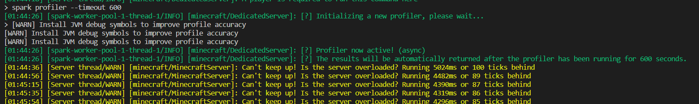

# 
## Build
```sh
cd benchmark-base
docker build . -t atm6
cd ../jvm
docker build . -t atm6:jvm
cd ../graalvm
docker build . -t atm6:graalvm
```

## Test
For each jvm and graalvm, run following command
```sh
docker run -it -p 25565:25565 atm6:jvm
```
```sh
docker run -it -p 25565:25565 atm6:graalvm
```

when server is fully loaded, profile by spark command

```sh
spark profiler --timeout 600
```




## World
1. To make benchmark fair, disable all entity spawning  on server.properties
```
spawn-animals=false
spawn-monsters=false
spawn-npcs=false
```

2. Fill 144 chunks with 36,864 (12 * 12 * 16 * 16) solar panel


3. Chunkload 144 chunks


## Result

### JVM
| tries | tps 5m  | memory (GB) | report |
|---|---|---|---|
| 1 | 15.68 | 2.7 | [jvm.1](report/e3Srcv4k8C.sparkprofile) |
| 2 | 17.07 | 3.3 | [jvm.2](report/iymVSyBMsO.sparkprofile) |
| 3 | 17.35 | 1.7 | [jvm.3](report/ofTJeaw4gN.sparkprofile) |
| 4 | 17.58 | 3.4 | [jvm.4](report/09Q0134xwZ.sparkprofile) |
| 5 | 19.37 | 2.6 | [jvm.5](report/tbQMufSn80.sparkprofile) |
| avg | 17.41 | 2.74 | |

### GraalVM
| tries | tps 5m | memory (GB) | report |
|---|---|---|---|
| 1 | 19.76 | 2.8 | [graalvm.1](report/mn5GHesw7E.sparkprofile) |
| 2 | 20 | 1.5 | [graalvm.2](report/DwluhwPgPd.sparkprofile) |
| 3 | 20 | 2.6 | [graalvm.3](report/ZtD6YqIqYX.sparkprofile) |
| 4 | 20 | 1.6 | [graalvm.4](report/pQTZ3zyCP4.sparkprofile) |
| 5 | 20 | 3.3 | [graalvm.5](report/lVMQE8lEsr.sparkprofile) |
| avg | 19.952 | 2.36 ||

## Note
 - If you want to see report file, use [online viewer](https://spark.lucko.me/)
 - I tried to generate flat map by minecraft:flat on server.properties, but it didn't work
 - I know there will be my userid on world file, but I don't think it will cause on security issue.
 - Require more complex map that can make tps below 20 on GraalVM